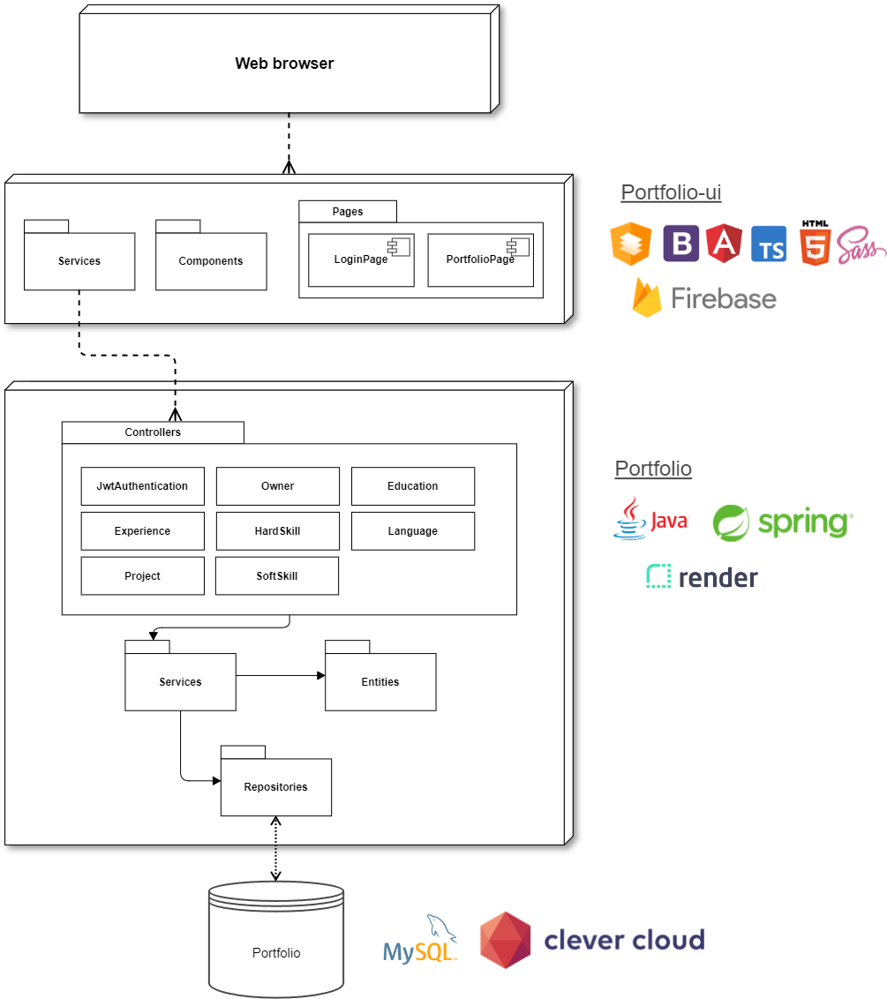
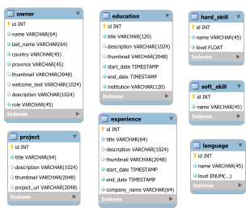

# Portfolio

Este proyecto fue generado con `SpringBoot 3.0.5`. Se utilizó `MySQL 8`

## Arquitectura

## Diagrama entidad-relación

## Documentación de la API
* HTML: `/swagger-ui/index.html`
* JSON: `/v3/api-docs`

## Environments

### Ejecutar en modo desarrollador
1. Descargar la base de datos [Descargar](https://drive.google.com/file/d/1woyDZjjc6f7krT72Zl0SGKYtQIwSiS9P/view?usp=share_link)
2. Ir a `application.properties`
3. Cambiar `#spring.profiles.active=dev` por `spring.profiles.active=dev`.
4. La configuración de la base de datos en modo desarrollador está en `application-dev.properties`.

La aplicación se ejecutará en `http://localhost:8080/` y la base de datos con el nombre de usuario `root` y contraseña `123456`.
Verificar que el nombre de la base de datos coincida con la configurada en `application-dev.properties`

### Ejecutar en modo producción

La aplicación está alojada en `https://portfolio-brenda-mareco.onrender.com/`.
